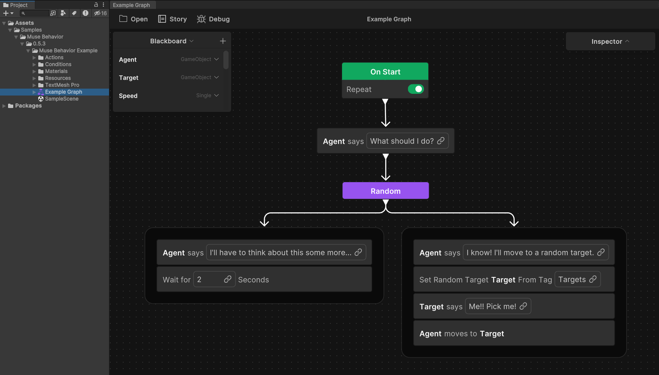

# Install Unity Behavior with the Package Manager

To install Unity Behavior using the Package Manager, perform the following steps:

1. In the Unity Editor, select **Window** > **Package Manager**.

    The Package Manager window appears.
2. Open the **Add** menu and select **Add package by name…**.
3. Type (or copy and paste) `com.unity.behavior` into the **Name** field, then select **Add**.
4. Select Package Manager's **In Project** context to view **Behavior** listed under **Packages - Unity**.

## Samples

The recommended best practice is to add the Unity Behavior sample as a starting point. It provides reference assets and helps you learn how to use the basic features of Unity Behavior. The sample includes a demo scene and predefined example actions that'll help you get started.

To use the sample provided with Unity Behavior, perform the following steps:

1. Open the Package Manager window, if it's not open already.
2. Select the **In Project** context from the list menu. 
3. Select the **Behavior** package in the list view.
4. Select the **Samples** tab in the package details panel.
5. Click **Import** next to the sample to import the sample folder in your project. 

    Unity creates a `Sample` folder in the **Project** window at `Assets` > `Sample` > `Behavior`.

6. Locate the sample scene, which is in your **Project** window at `Assets` > `Samples` > `Behavior` > `[Version Number]` > `Unity Behavior Example` > `SampleScene.unity`.

7. Add the sample scene to the **Scene** view by double-clicking `SampleScene.unity` or dragging-and-dropping it into the **Hierarchy** window. 

8. Locate the example behavior graph, which is in your **Project** window at `Assets` > `Samples` > `Behavior` > `[Version Number]` > `Unity Behavior Example` > `Example Graph.asset`.

9. Open the example behavior graph by double-clicking `Example Graph.asset`.

   

To continue your journey, explore the sample scene and add some more actions in your project.

## Additional resources

* [Create a behavior graph](create-behavior-graph.md)
* [Unity Behavior editor user interface](user-interface.md)
* [Behavior graph example](example.md)